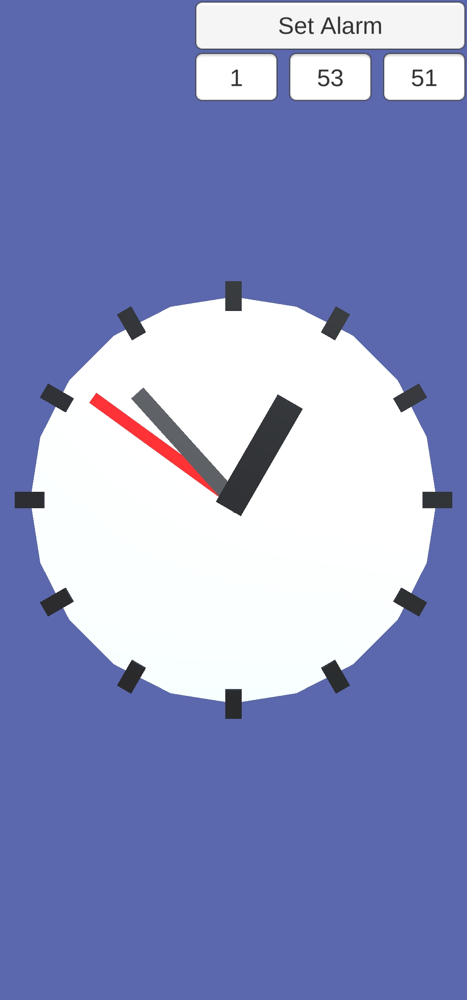
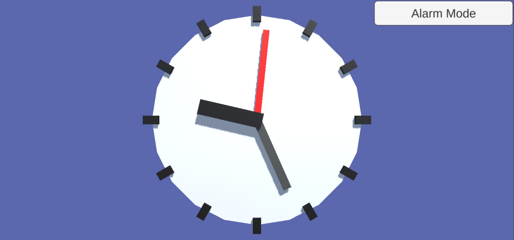
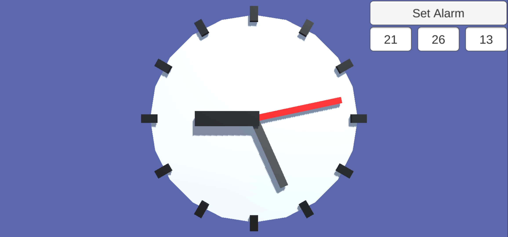
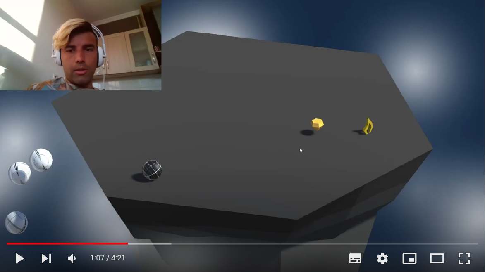

<h1 align="center">Hi 👋, I'm Michail Kustikov</h1>
<h3 align="center">Also known as Ferundal, i <a href="https://www.youtube.com/c/Ferundal" target="blank">play games</a> and making them</h3>

- 🔭 I’m currently working on **Personal Pet Project**

- 🌱 I’m currently learning **C#, C++, Unity Engine**

<h3 align="left">Contacts:</h3>

 <a href="www.linkedin.com/in/michail-kustikov" target="blank">Michail Kustikov</a>

 <a href="ferundal@gmail.com" target="blank"> ferundal@gmail.com</a>

 <a href="https://t.me/ferundal" target="blank">@ferundal</a>

 <a href="discordapp.com/users/Ferundal#7929" target="blank">Ferundal#7929</a>

---
<h3 align="left">My projects:</h3>

 Unity

Unity become my first step in the game development. Inside sections projects sorted from latest to oldest.
    
+ 

    
 Test tasks

    During job search i made few projects in limeted time to prove my qualification.
    
    + 

        
<a href="https://github.com/Ferundal/Libft" target="blank">Alarm Clock</a>

        Simple Android application. Get time from internet, show it to user.
        User can set up alarm time by entering numerals in the fields or by moving clock hands.
        Work in both portrait and landscape mode.
        <table>
            <tr>
                <td rowspan = "2">
                    
                </td>
                <td>
                    
                </td>
            </tr>
            <tr>
                <td>
                    
                </td>
            </tr>
    </table>
      

   

+ 

    
 Junior Programmer Pathway

        
    During my path to <a href="https://www.credly.com/badges/4378bc78-5530-4bd4-9bcd-ff089fc1cdb3/public_url" target="blank">Unity Junior Programmer</a> badge in <a href="https://learn.unity.com/pathway/junior-programmer">Junior Programmer Pathway</a>, i made a few projects showing my new skills.
    + 

        
<a href="https://github.com/Ferundal/Libft" target="blank">Roll ball</a>

    
        Game purpose is to hold as long as possible on the board. Pick up power ups to trow enemy balls away from the board, some of them can be used by pressing "space".
    
        
      

   

 Ecole 42

    

Following projects was made during my education in russian campus of <a href="https://en.wikipedia.org/wiki/42_(school)" target="blank">Ecole 42</a> programming school. From latest to oldest.
    
+ 

    
<a href="https://github.com/Ferundal/ft_printf/tree/master#readme" target="blank">ft_printf</a>

    Recode of C standard library printf. First meet with variadic functions.
    
    + 

        
Heading1.1.1

        even more text
      

   

+ 

    
<a href="https://github.com/Ferundal/Libft" target="blank">Libft</a>

    First project as a student at 42. Just recode a few functions of the C standard library as well as some other utility functions that i will use during your whole cursus.
    
    Code follow <a href="https://github.com/42School/norminette/blob/master/pdf/en.norm.pdf" target="blank">specific Ecole 42 code style</a>.
    + 

        
Heading1.1.1

        even more text
      

   

